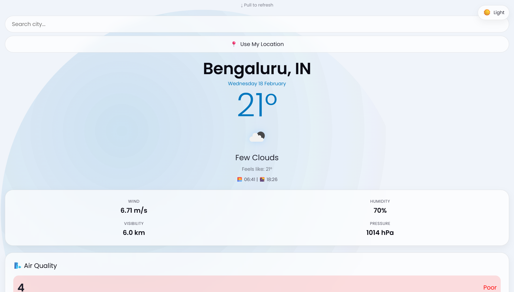
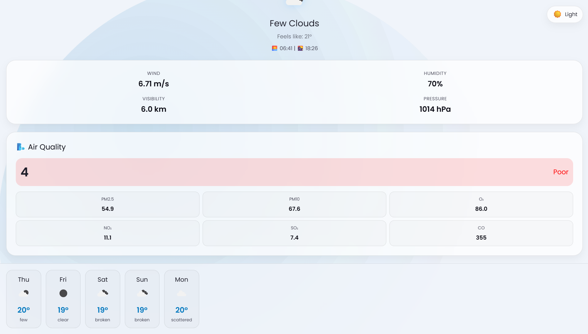
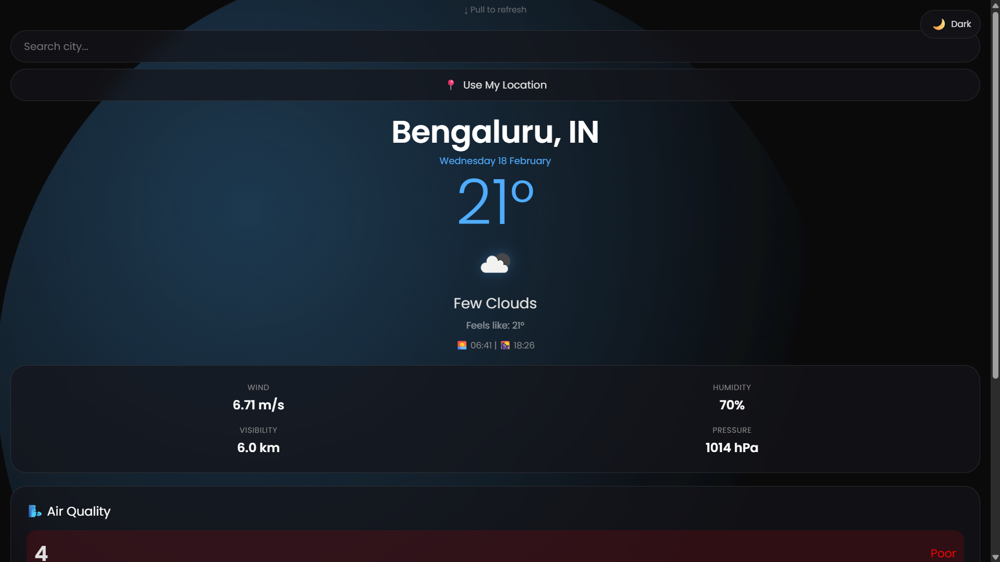
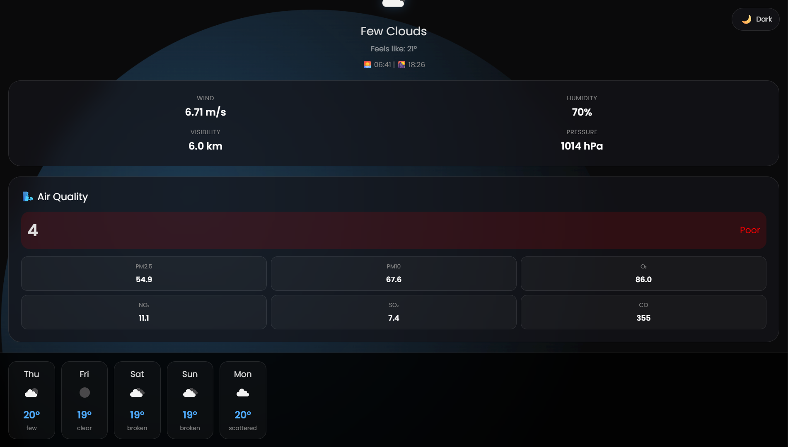

# 🌙 Midnight Weather App

A beautiful, responsive weather application with dark/light theme support, animated background, and comprehensive weather data including air quality and UV index.



## 📱 Features

### Core Features
- **Real-time Weather Data** - Current temperature, feels like, humidity, wind speed, visibility, and pressure
- **7-Day Forecast** - Weather forecast with icons and temperature ranges
- **Air Quality Index** - Real-time AQI with detailed pollutant breakdown (PM2.5, PM10, O₃, NO₂, SO₂, CO)
- **UV Index** - UV levels with color-coded risk levels and safety recommendations
- **Sun Times** - Sunrise and sunset times for any location

### User Experience
- **🌓 Dual Theme** - Seamless switch between dark and light modes
- **✨ Animated Background** - Floating gradient orbs that adapt to the theme
- **📍 Geolocation** - Get weather for your current location
- **🔍 City Search** - Search any city worldwide
- **📱 Mobile Optimized** - Touch-friendly interface with pull-to-refresh
- **🖥️ Responsive Design** - Works perfectly on all devices

## 🖼️ Screenshots

| Dark Theme | Light Theme | Air Quality |
|------------|-------------|-------------|
|  |  |  |

| Forecast | UV Index | Mobile View |
|----------|----------|-------------|
|  |  |  |

## 🚀 Live Demo

[View Live Demo](https://whether-application-mu.vercel.app/)

## 🛠️ Technologies Used

- **HTML5** - Semantic markup
- **CSS3** - Custom properties, animations, flexbox, grid
- **JavaScript** - ES6+, async/await, fetch API
- **OpenWeatherMap API** - Weather data, forecast, air pollution

## 📦 Installation

1. **Clone the repository**
```bash
git clone https://github.com/yourusername/midnight-weather.git
cd midnight-weather
```

2. **Get an API key**
- Sign up at [OpenWeatherMap](https://openweathermap.org/api)
- Get your free API key
- Replace the `apiKey` in `script.js` with your key

3. **Run the app**
- Open `index.html` in your browser
- Or use a local server:
```bash
# Using Python
python -m http.server 8000

# Using Node.js
npx live-server
```

## 🔧 Configuration

### API Key Setup
In `script.js`, replace the API key:
```javascript
const apiKey = "YOUR_API_KEY_HERE";
```

### Theme Customization
Modify color variables in `style.css`:
```css
:root {
    --accent-blue: #4facfe;  /* Primary accent color */
    --bg-color: #0a0a0b;      /* Dark theme background */
}

body.light {
    --accent-blue: #0077be;   /* Light theme accent */
}
```

## 📁 Project Structure

```
weather-app/
│
├── index.html          # Main HTML file
├── style.css           # All styles and themes
├── script.js           # JavaScript functionality
├── README.md           # Documentation
│
└── images/             # Screenshots
    ├── 1.png           # Dark theme preview
    ├── 2.png           # Light theme preview
    ├── 3.png           # Air quality card
    └── 4.png           # Forecast section
```

## 🎯 Usage

### Search for a City
1. Type a city name in the search bar
2. Press Enter or tap the search icon
3. View comprehensive weather data

### Use Current Location
1. Click "Use My Location" button
2. Allow location access when prompted
3. Get instant weather for your area

### Toggle Theme
- Click the floating theme button (🌙/☀️)
- Theme preference is saved automatically

### Pull to Refresh (Mobile)
- Pull down from the top to refresh weather data
- Works on all touch devices

## 🌐 API Reference

This app uses the following OpenWeatherMap APIs:

| API | Endpoint | Purpose |
|-----|----------|---------|
| Current Weather | `data/2.5/weather` | Current conditions |
| 5-Day Forecast | `data/2.5/forecast` | 7-day forecast |
| Air Pollution | `data/2.5/air_pollution` | AQI and pollutants |
| UV Index | Simulated | UV levels (fallback) |

## 🤝 Contributing

Contributions are welcome! Here's how you can help:

1. Fork the repository
2. Create a feature branch (`git checkout -b feature/AmazingFeature`)
3. Commit changes (`git commit -m 'Add AmazingFeature'`)
4. Push to branch (`git push origin feature/AmazingFeature`)
5. Open a Pull Request

## 📝 License

This project is licensed under the MIT License - see the [LICENSE](LICENSE) file for details.

## 👏 Acknowledgments

- [OpenWeatherMap](https://openweathermap.org/) for the comprehensive weather APIs
- [Google Fonts](https://fonts.google.com/) for the Poppins font family
- [Flaticon](https://www.flaticon.com/) for weather icons inspiration
- All contributors and users of this app

## 📧 Contact

Project Link: [https://github.com/2024Nandu/Whether-Application](https://github.com/2024Nandu/Whether-Application)

## 🚦 Future Enhancements

- [ ] Hourly forecast graph
- [ ] Weather alerts and notifications
- [ ] Multiple location saving
- [ ] Weather maps integration
- [ ] Historical weather data
- [ ] Weather widgets for home screen
- [ ] PWA support for offline usage
- [ ] More detailed weather metrics


